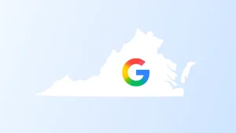

# Error 404 (Not Found)!!!
> 原文链接: https://blog.google/technology/ai/gemini-3-1-pro-preview-2026

---

# This page doesn't exist.

Let's get you back on track!

Try using the search bar or [visiting our homepage](https://blog.google/).

## All stories

-   [

    ### How we're combatting AI scams with security, legislation and more

    

    ](https://blog.google/innovation-and-ai/technology/safety-security/combatting-ai-scams/)
-   [

    ### Our new community investments in Virginia support local jobs and expand energy affordability.

    

    ](https://blog.google/innovation-and-ai/infrastructure-and-cloud/global-network/virginia-community-investments/)
-   [

    ### Enhanced Local Services Ads for Home Listings bring homebuyers and local agents together.

    

    ](https://blog.google/products/ads-commerce/new-real-estate-ads-formats/)
-   [

    ### We’re bringing Walmart Connect to Display & Video 360.

    

    ](https://blog.google/products/marketingplatform/360/walmart-connect/)
-   [

    ### Growing the next generation of American workers

    

    ](https://blog.google/company-news/outreach-and-initiatives/google-org/skilled-trades/)
-   [

    ### Step inside 50 new digital exhibitions from Africa on Google Arts & Culture

    

    ](https://blog.google/company-news/outreach-and-initiatives/arts-culture/50-new-digital-exhibitions-from-africa-on-google-arts-culture/)
-   [

    ### DiffusionGemma: 4x faster text generation

    

    ](https://blog.google/innovation-and-ai/technology/developers-tools/diffusion-gemma-faster-text-generation/)
-   [

    ### Save time and grow your business with new Gemini tools

    

    ](https://blog.google/innovation-and-ai/products/gemini-app/gemini-features-for-businesses/)
-   [

    ### We’re expanding Gemini in Chrome to users in Latin America, Africa, the Middle East and more.

    

    ](https://blog.google/products-and-platforms/products/chrome/chrome-expands-latin-america/)

Load more stories